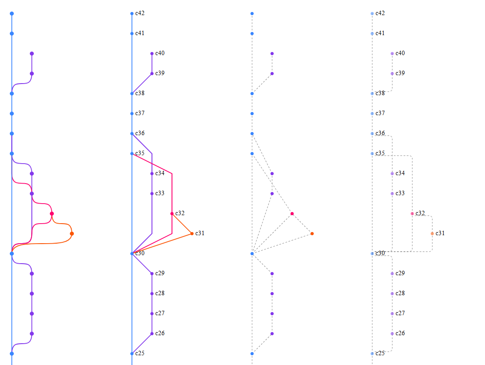

# GitGraphSVG

A lightweight, customizable **SVG-based Git commit graph renderer for
React**.

`GitGraphSVG` renders a commit history with branching and merging
support, automatic lane allocation, and customizable node/edge
rendering.

------------------------------------------------------------------------

## ✨ Features

-   🔀 Automatic branch lane management\
-   🎨 Customizable color palette\
-   🧩 Render overrides (`renderNode`, `renderEdge`)\
-   📐 Fully SVG-based (no canvas)\
-   ⚡ Lightweight & dependency-free

------------------------------------------------------------------------

## 📐 Screenshots


## 🚀 Basic Usage

``` tsx
import { GitGraphSVG, CommitItem } from "./GitGraphSVG";

const commits: CommitItem[] = [
  {
    id: "a1",
    message: "Initial commit",
    author: "Akshay",
    date: "2026-02-18T09:12:45",
    parents: [],
  },
  {
    id: "b2",
    message: "Add feature",
    author: "Akshay",
    date: "2026-02-18T10:30:12",
    parents: ["a1"],
  },
];

export default function App() {
  return <GitGraphSVG commits={commits} />;
}
```

------------------------------------------------------------------------

## 📘 Data Model

### CommitItem

``` ts
export interface CommitItem {
  id: string;
  message: string;
  author: string;
  date: string;
  parents: string[];
}
```

Each commit must reference its parent commit IDs in the `parents` array.

------------------------------------------------------------------------

## ⚙️ Props

``` ts
export interface GitGraphSVGProps {
  commits: CommitItem[];

  rowHeight?: number;
  laneWidth?: number;
  colorPalette?: string[];

  renderNode?: (commit: _CommitItem) => React.ReactNode;

  renderEdge?: (
    from: _CommitItem,
    to: _CommitItem,
    defaultPath: string
  ) => React.ReactNode;
}
```

------------------------------------------------------------------------

## 🎨 Custom Rendering

You can override how nodes and edges are rendered.

### Custom Nodes

``` tsx
<GitGraphSVG
  commits={commits}
  renderNode={(commit) => (
    <g key={commit.id}>
      <circle
        cx={commit.cx}
        cy={commit.cy}
        r={8}
        fill="white"
        stroke={commit.color}
        strokeWidth={3}
      />
      <text
        x={commit.cx}
        y={commit.cy - 10}
        textAnchor="middle"
        fontSize={10}
      >
        {commit.id}
      </text>
    </g>
  )}
/>
```

------------------------------------------------------------------------

### Custom Edges

``` tsx
<GitGraphSVG
  commits={commits}
  renderEdge={(from, to, path) => (
    <path
      key={`${from.id}-${to.id}`}
      d={path}
      stroke="black"
      strokeDasharray="4 2"
      fill="none"
    />
  )}
/>
```

------------------------------------------------------------------------

## 🎨 Default Configuration

``` ts
const LANE_WIDTH = 50;
const NODE_RADIUS = 5;

const COLOR_PALETTE = [
  "#3a86ff",
  "#8338ec",
  "#ff006e",
  "#fb5607",
  "#ffbe0b"
];
```

If more branches exist than available colors, random colors are
generated automatically.

------------------------------------------------------------------------

## 📏 Layout Rules

-   Vertical spacing = `rowHeight`
-   Horizontal spacing = `laneWidth`
-   SVG width = `lanesCount * laneWidth`
-   SVG height = `commits.length * rowHeight`

------------------------------------------------------------------------

## 🔄 Merge & Branch Handling

-   Straight lines are drawn when commits stay in the same lane.
-   Smooth Bézier curves are used when switching lanes.
-   Multiple parents are supported.
-   Lane colors are automatically reassigned when branches end.

------------------------------------------------------------------------

## 🧠 Design Philosophy

`GitGraphSVG` is designed as a **rendering engine**, not a UI component.

It: - Calculates layout - Assigns lanes and colors - Generates edge
paths - Exposes rendering hooks

You control the visual layer.

------------------------------------------------------------------------

## 🚀 Possible Future Enhancements

-   Animations
-   Hover interactions
-   Zoom & pan
-   Horizontal layout support
-   Stepped lane transitions
-   Commit grouping
-   Performance optimization for large graphs

------------------------------------------------------------------------

## 📜 License

MIT
